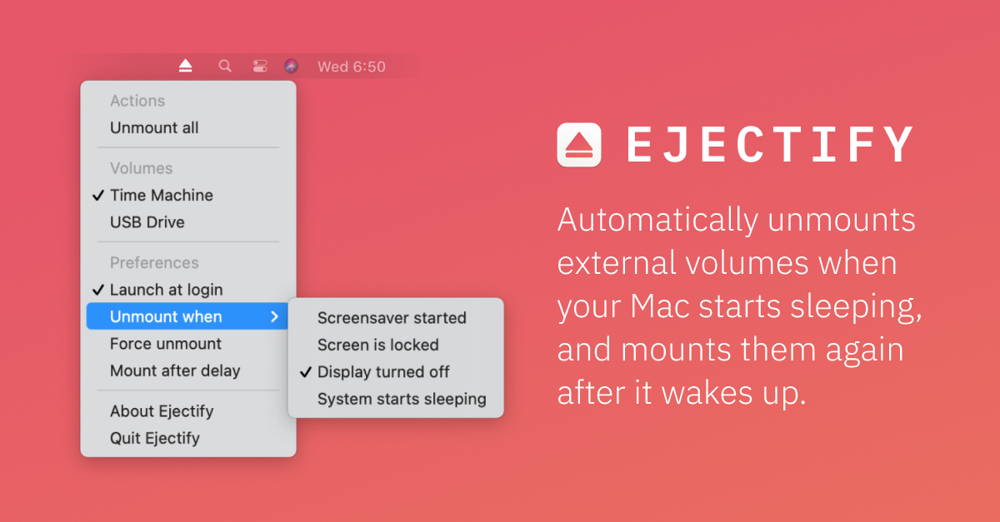

# Ejectify for Mac

[Ejectify](https://ejectify.app) automatically unmounts external volumes when your Mac starts sleeping, and mounts them again after it wakes up. It becomes handy when you have connected a USB drive to an external display that gets powered off when your Mac starts sleeping, causing the drive to be ejected forcefully.  

## Features

⭐ Prevents annoying *Disk not ejected properly* notifications when your Mac wakes up.

⭐ Prevents connected external disks and their volumes to get corrupted.

⭐ Configure what volumes should be (un)mounted automatically, optionally forcefully.

⭐ Available in English, Dutch, German, French, Spanish, Russian, Japanese, Portuguese, Hindi and Arabic.

⭐ Configure when volumes should be unmounted:

- When the screensaver starts.
- When the screen is locked.
- When the screens started sleeping.
- When the system starts sleeping.

⭐ Automatically mounts volumes again when your Mac or screens wake up, optionally after a delay.

⭐ Unmount all volumes instantly with the click of a button.

## Download

[Download Ejectify](https://gum.co/ejectify) by supporting me via Gumroad, something I would really appreciate! This helps covering development costs. Otherwise feel free to clone this repository and build a runnable application yourself.
  
## Communication

🐛 If you found a bug, open an [issue](https://github.com/nielsmouthaan/ejectify-macos/issues).

💡 If you have a feature request, open an [issue](https://github.com/nielsmouthaan/ejectify-macos/issues).

🧑‍💻 If you want to contribute, submit a [pull request](https://github.com/nielsmouthaan/ejectify-macos/pulls).

## Frequently asked questions

### The app doesn't start. What can I do?

Make sure Ejectify is copied into your Applications directory and run from there. Also, note that the app lives in the menu bar of your Mac. There should be an eject icon somewhere near your clock. There is no other user interface that pops up when you start it.

### Why do I still receive notifications?

Ejectify works by (trying to) unmount volumes (on external disks) before your screensaver starts, screen locks, display(s) turns off, or the system starts sleeping. Sometimes this doesn't result in the desired behavior. In this case, try the following:

- Ensure the correct volumes are checked in Ejectify's status bar menu. Ejectify will only attempt to unmount those.

- Toggle between the various `Unmount when` options. Depending on your (hardware) configuration, some options work better than others.

- In case you've connected the disk via a USB hub, temporarily attach it directly to your Mac and test if that makes a difference.

- Temporary check `Force unmount` to see if that makes a difference. This (unsafe) option (almost) immediately eject disks, even when apps or macOS are still using it, which could result in data loss. When this resolves the issue, it's likely that an app or macOS is causing the issue. See [this page](https://serverfault.com/a/159428) to find out which app.

- Use the [Console app](https://support.apple.com/en-gb/guide/console/welcome/mac) to see if any warnings or errors are popping up that might indicate why Ejectify isn't able to (un)mount the disk. Specifically look for a message starting with `Dissenter status`, which includes the result of the (un)mount process.

Ejectify might not (always) prevent notifications to appear. This is mostly caused by external hardware (such as USB hubs). Contact me via [this form](https://ejectify.app/#contact) and provide the email address used to purchase Ejectify so I can initiate a refund.

### Does Ejectify support Apple Silicon (M1 & M2)?

Yes it does. Ejectify is built as an [Universal macOS Binary](https://developer.apple.com/documentation/apple-silicon/building-a-universal-macos-binary) meaning it natively supports Intel and Apple Silicon processors.

## License

Ejectify is available under the MIT license and uses source code from open source projects. See the [LICENSE](https://github.com/nielsmouthaan/ejectify-macos/blob/main/LICENSE) file for more info.
